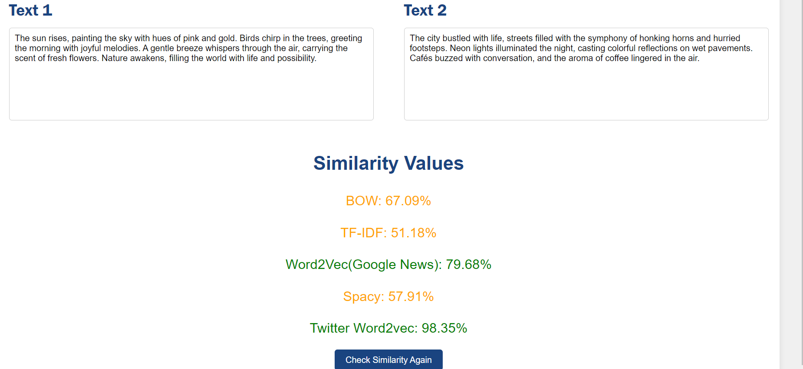

# NLP Projects
## 1 ) Text Similarity Project - Deployed With Django
### BOW
### TF-IDF
### Gensim - Pretrained Model (Google News Model)
### Gensim - Trained on Tweets Dataset
### Spacy Model "en_core_web_md"
## Web App Preview
### Main Screen

### Test 1 - High Similarity 

### Test 1 - Low Similarity 

